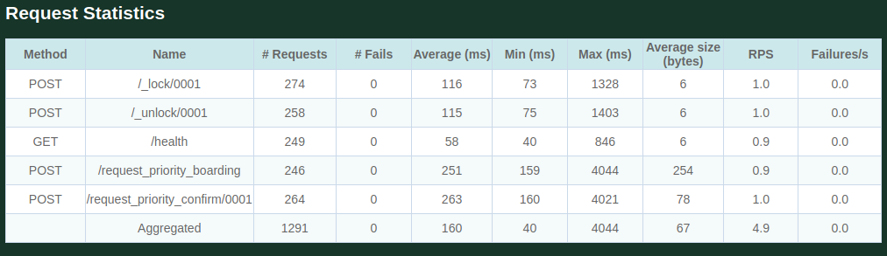
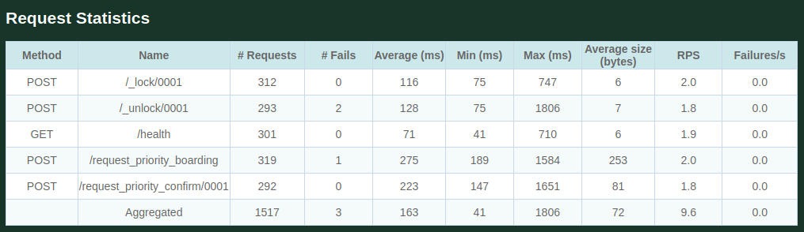
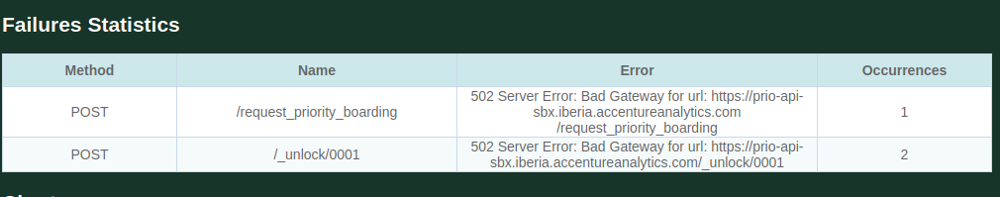
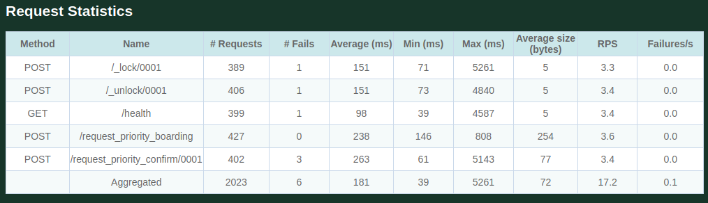
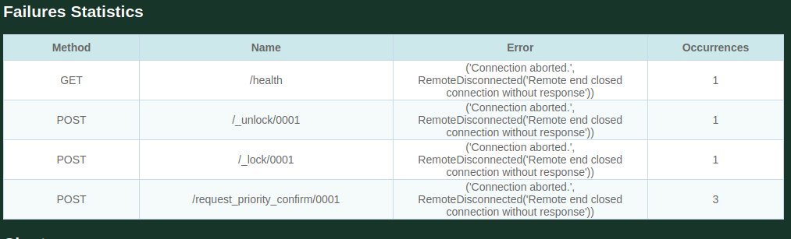
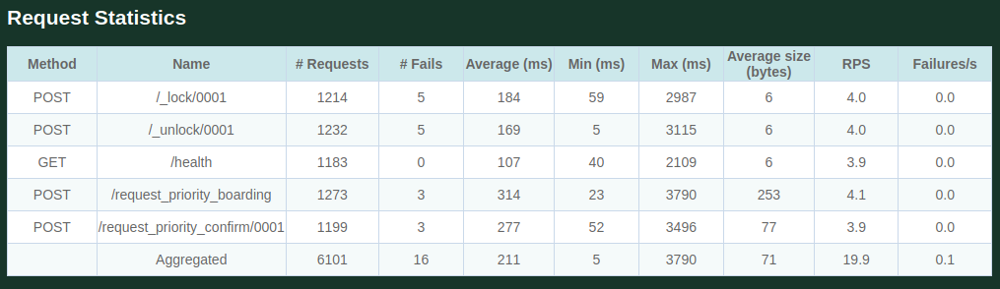
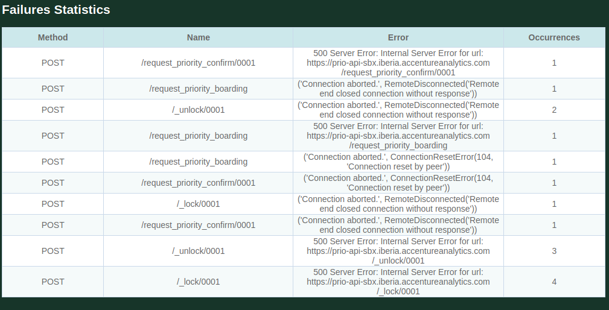

# Stress Testing

Stress tests have been performed against the sandbox environment (https://prio-api-sbx.iberia.accentureanalytics.com) with 50, 100 and 200 total users, with a spawn rate in all cases of 5 users per second.
The tests have been performed against /health, _lock/, _unlock/, /request_priority_confirm and /request_priority_boarding endpoints, producing in all cases similar results.

### 50 simultaneous users, spawn_rate=5users/sec:
There have been 0 errors out of 1291 requests. 
The average response time is 160 ms.

### 100 simultaneous users, spawn_rate=5users/sec.
In a total of 1517 requests, ~0% have ended up in error, only 3 requests.
These errors are connections terminated without sending a complete response (the system continues to work).
The average response time is 164ms

### 200 simultaneous users, spawn_rate=5users/sec:
In a total of 2023 requests, the number of failed requests is 6, which is 
0% of the total, being in all cases errors that do not prevent the operation of the system.

### 200 simultaneous users, spawn_rate=200users/sec:
In a total of 6101 requests, the number of failed requests is 16, which is 0% of the total, being in all cases errors that do not prevent the operation of the system.

